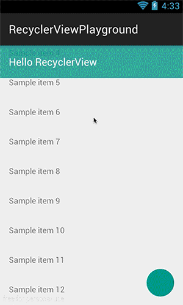

RecyclerViewPlayground
======================

## RecyclerView.OnScrollListener
RecyclerView now provides an OnScrollListener which is powerful enough to let us know how many pixels we scrolled, where we are standing now after scrolling, and which direction of scrolling (in both horizontal and vertical). This helps us easily (less code and less overhead) implement some sort of UI pattern like what [FloatingActionButton](https://github.com/makovkastar/FloatingActionButton), or [PoppyView](https://github.com/flavienlaurent/poppyview) already did.

Full video: https://www.youtube.com/watch?v=1HiSGozY7Sk

